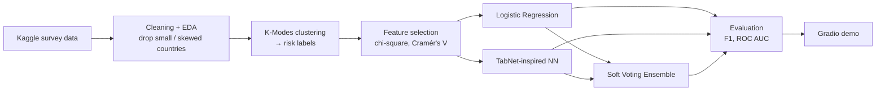

<div align="center">

# 🧠 Mental Health Risk Modeling

**Multiclass (Low / Medium / High) mental health risk prediction from survey data, with three models compared and a Gradio demo app.**


[](https://youtu.be/VCkYcj3GoHY)
[](https://www.kaggle.com/datasets/bhavikjikadara/mental-health-dataset)

</div>

## Overview
Mental health care often starts too late. This capstone asks whether a short set of survey answers can flag who is at **low, medium, or high risk**, so outreach can start earlier. Risk labels were built with **K-Modes clustering**. The five features that most strongly defined the clusters were then **removed before modeling** to avoid label leakage. That also tests whether risk can still be predicted when social and lifestyle data is missing.

## Key results
Test set: **78,296 respondents** (held-out split). The numbers come from the `classification_report` output in each notebook and from `images/results/model_metrics_table.jpg`.

| Model | Accuracy | Macro F1 | ROC AUC (micro) |
|---|:-:|:-:|:-:|
| Logistic Regression (poly features + elastic net) | 0.73 | 0.73 | 0.84 |
| Soft Voting Ensemble | 0.78 | 0.78 | 0.93 |
| **TabNet-inspired Tabular NN (tuned)** | **0.79** | **0.78** | **0.94** |

- The TabNet-style network was tuned over a 54-configuration grid (steps × feature dim × batch size × learning rate). Its best validation accuracy was **0.787**.
- **Mood swings, coping struggles, and treatment history** were the strongest risk signals in the bivariate analysis.

<p align="center"></p>

## Approach


<details><summary>Workflow diagram and TabNet ROC curve</summary>


</details>

## Dataset
[Mental Health Dataset (Kaggle)](https://www.kaggle.com/datasets/bhavikjikadara/mental-health-dataset): self-reported survey responses covering gender, country, occupation, family history, treatment, stress, mood, and coping. After cleaning there are **260,986 rows**, split into 182,690 for training and 78,296 for testing. The final model uses **8 features**. The raw, cleaned, and encoded splits are all in `data-assets/`.

## Tech stack
Python · pandas · NumPy · scikit-learn · TensorFlow/Keras · Optuna · XGBoost · SciPy · Matplotlib/Seaborn · Gradio · joblib

## Repository structure
```
mental-health-risk-modeling/
├── data-assets/            # raw, cleaned, split and encoded datasets (.csv / .pkl)
├── images/                 # EDA, preprocessing, model and results figures
├── notebook-pipeline/
│   ├── clean_filtered_eda.ipynb
│   ├── split_preprocessing.ipynb
│   └── models/             # logistic-regression/, tab-neural-network/, soft-voting/
├── user-interface/         # Gradio apps (logistic + TNN) and UI screenshots (PDF)
├── requirements.txt
└── LICENSE
```

## How to run
```bash
git clone https://github.com/oxayavongsa/mental-health-risk-modeling.git
cd mental-health-risk-modeling
pip install -r requirements.txt
jupyter notebook notebook-pipeline/clean_filtered_eda.ipynb
```
Run the notebooks in this order: `clean_filtered_eda` → `split_preprocessing` → each model in `notebook-pipeline/models/`. They were written in Google Colab and load data from Google Drive paths. Before running them locally, point those paths at `data-assets/`.

**Demo UI:** open `user-interface/mental_health_risk_predictor_logistic.ipynb` with `logistic_pipeline_model.pkl` in the working directory, or open `mental_health_risk_predictor_TNN.ipynb` with `tabnet_grad_3.keras`. Both model files are in `notebook-pipeline/models/`.

> **Intended use:** this is a research and education project. It supports professional judgment and is **not** a diagnostic tool.

## Team & credits
AAI-590 Capstone, Shiley-Marcos School of Engineering, University of San Diego.
**Outhai Xayavongsa** (Team Lead) · Aaron Ramirez (Tech Lead) · Prema Mallikarjunan. Advised by Professor Anna Marbut.

---
<sub>Maintained by **Outhai (Thai) Xayavongsa** (MS Applied AI, University of San Diego · MBA) · [GitHub](https://github.com/oxayavongsa) · [Portfolio](https://oxayavongsa.github.io/ai-automation-portfolio/)</sub>
